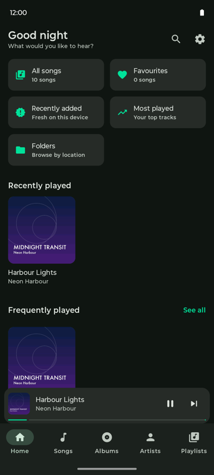
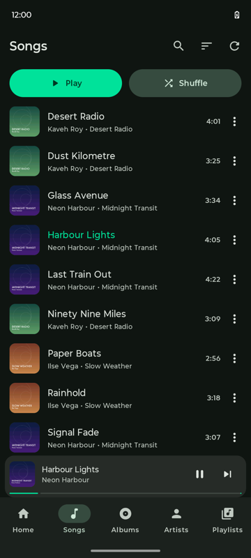
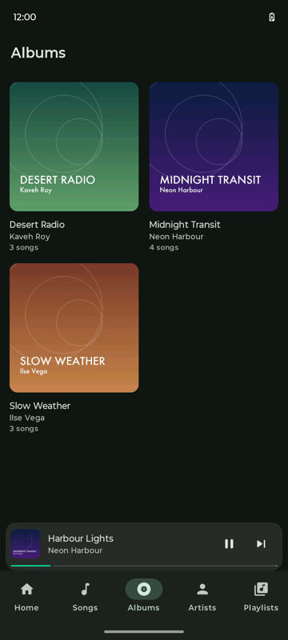
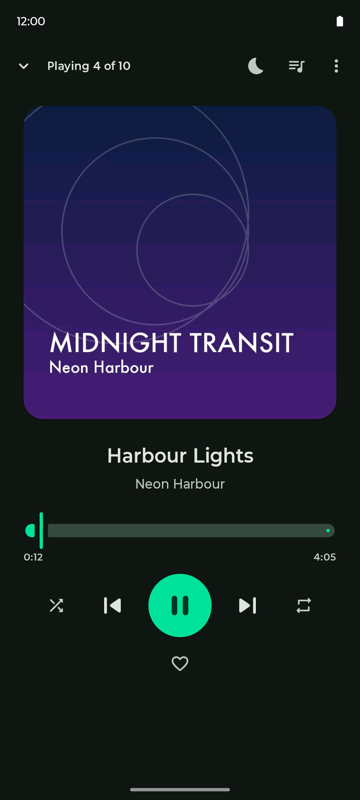
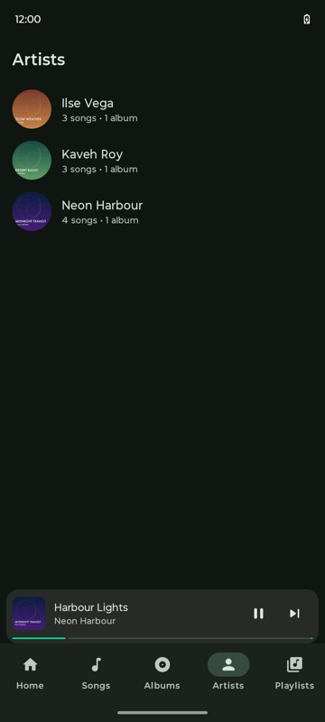
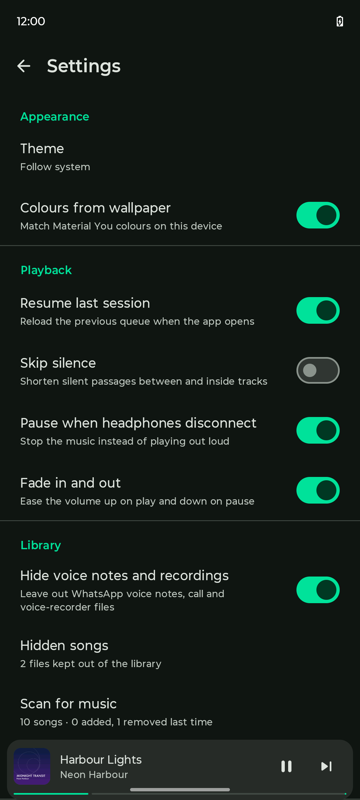
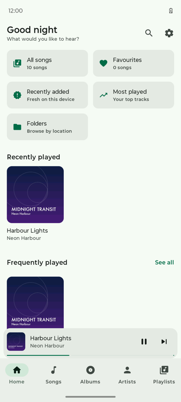
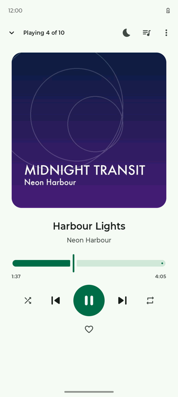

# Moto Music

An offline music player for Android. It plays the audio files already on your phone — no account,
no ads, no analytics, and **no internet permission at all**.

Many Android phones ship without a music player, and the free ones people install instead are paid
for with advertising. This is the alternative: a small, ad-free player that cannot phone home,
which you can verify yourself in one line of the manifest.

> **Status: 0.1.0, early.** It has been built and walked end to end on one phone (moto g54 5G,
> Android 15). Lock-screen and Bluetooth transport controls, headphone-disconnect pause and the
> sleep timer actually firing have not been verified yet, and there are no UI tests. Treat it as
> a working preview, not a finished product.

> **Not affiliated with Motorola or Lenovo.** "Moto Music" is an independent hobby project and is
> neither endorsed by nor connected to any phone manufacturer.

## Screenshots

| Home | Songs | Albums | Player |
| --- | --- | --- | --- |
|  |  |  |  |

| Artists | Settings | Home, light theme | Player, light theme |
| --- | --- | --- | --- |
|  |  |  |  |

The music in these screenshots is a demo library generated for the purpose — the audio, the
artwork and the artist and album names are all invented, so nothing here borrows anybody's
copyright. Colours come from the phone's wallpaper through Material You, so the app will not
look exactly like this on yours.

## What it does

- Your library by **songs, albums, artists and folders**, read from `MediaStore`
- **Playlists**, favourites, recently played and most played, all stored locally
- Full player with queue, shuffle, repeat, seek, and a **sleep timer**
- Media notification, so it keeps playing with the screen off
- **Fades in and out** on play and pause instead of cutting the sound
- **Hides voice notes and recordings** — WhatsApp voice notes are marked as music by Android
  itself, which is why other players fill up with them. Off by default; individual files can be
  hidden by hand from a song's ⋮ menu
- Material 3 with **dynamic colour**, light and dark themes
- Resumes your last queue when you reopen the app

## Privacy

The app requests exactly these permissions, and no others:

| Permission | Why |
| --- | --- |
| `READ_MEDIA_AUDIO` (`READ_EXTERNAL_STORAGE` below Android 13) | To find and play your audio files |
| `POST_NOTIFICATIONS` | To show the playback notification |
| `FOREGROUND_SERVICE`, `FOREGROUND_SERVICE_MEDIA_PLAYBACK` | To keep playing when the app is not on screen |
| `WAKE_LOCK` | To keep playing with the screen off |

There is no `INTERNET` permission, so playlists, play counts and searches **cannot** be sent
anywhere, by this app or by anything inside it — not by mistake, not by a future dependency.
Everything is kept in a local database that is deleted when you uninstall. Your music files are
never modified.

## Building

Needs the Android SDK and JDK 17. Point `local.properties` at your SDK
(`sdk.dir=/path/to/Android/sdk`), or export `ANDROID_HOME`.

```bash
./gradlew :app:assembleDebug        # app/build/outputs/apk/debug/app-debug.apk
./gradlew :app:testDebugUnitTest    # unit tests
./gradlew :app:lintDebug            # lint — expected to stay at zero issues
```

The debug build installs as `com.motomusic.app.debug` and is named "Moto Music (debug)", so it can
sit alongside a release build. **Judge performance only on a release build**: a debug build is not
optimised, is `debuggable`, and never installs Compose's baseline profiles, which on the test phone
was the difference between 65% and 12% janky frames on the same code.

Release builds are signed from a `keystore.properties` in the project root, which is not committed:

```properties
storeFile=/absolute/path/to/release.jks
storePassword=…
keyAlias=…
keyPassword=…
```

Without that file the release build falls back to the local debug key and names itself
`0.1.0-debugsigned`. **Never publish a build carrying that suffix** — once anyone installs a
debug-signed APK, no properly signed update can replace it.

## Contributing

Issues and pull requests are welcome — see [CONTRIBUTING.md](CONTRIBUTING.md).
[RUNBOOK.md](RUNBOOK.md) is the project's working notes: architecture, conventions, and every
gotcha already paid for.

## Licence

[GNU General Public License v3.0](LICENSE). You may use, study, change and share it; any version
you distribute must stay free software under the same licence. That is deliberate — the point of
this project is that nobody has to accept ads to play their own music files.
